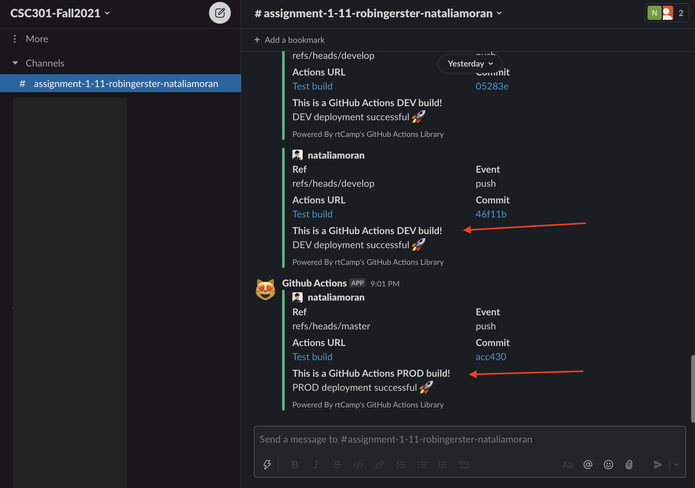

# Usage Instructions

1. Please see video demonstrations

    * **Desktop video demonstration:** https://www.youtube.com/watch?v=qZM1rkoFAws

    * **Mobile video demonstration:** https://www.youtube.com/watch?v=9ZiGH6hxZsw

    * **Admin System video demonstration:** https://www.youtube.com/watch?v=9Q4AujJmarQ

2. Please open the Calculator website using the `develop` or `prod` domain  
    * **PROD Host:** http://ec2-54-202-56-60.us-west-2.compute.amazonaws.com/
        * **Admin System:** http://ec2-54-202-56-60.us-west-2.compute.amazonaws.com/admin/
            * login: admin
            * password: 1111

    * **DEV Host:** http://ec2-34-216-118-180.us-west-2.compute.amazonaws.com/
        * **Admin System:** http://ec2-34-216-118-180.us-west-2.compute.amazonaws.com/admin/
            * login: admin
            * password: 1111

3. On the calculator website you will see different product categories: `All`, `Dairy`, `Bakery`, `Veggies`. 
Please use these categories to filter products.

4. Choose products by clicking the button `Add` near the product of your choice. 

5. If you want to remove some product from your shopping cart, please click the button `Remove`. 
If you previously added multiple quantities of some product, you would need to click `Remove` multiple times. 

6. To checkout click `Shop` button. 
Please notice that a discount is calculated automatically. All discounts are configurable in the admin system. 
    * If a user spends more than $50, this user gets the discount 5%
    * If a user spends more than $100, this user gets the discount 10%
    * If a user spends more than $200, this user gets the discount 20%

7. To go back to grocery shopping, click `Store` button.

8. To read about us, click `About` in the menu.

9. To see our contact details, click `Contact Us` in the menu.

10. To go back to the store, click `Calculator` or `Store` in the menu.

11. To update the website content please use the admin system. 
You can add, edit and remove categories, discounts and products.
Also, you can view all product orders made on the website and their timestamps. 

# Additional Functionality
1. The website has a navigation bar 
2. Each product has a category and can be filtered by its category
3. Additional pages: `About` and `Contact Us`
4. Automated multi-level discounts: the more a user pays, the larger discount this user gets 
5. All calculations are made by a backend. The backend is implemented with Django 
6. Admin system to add, edit and delete products, categories, and discounts. 
Also, all shopping orders are recorded and can be viewed in the admin system
7. SQLite3 Database
8. REST API to retrieve product information and to checkout
9. Extensive test coverage (please see `backend/calculator/tests.py`)
10. Automated testing and deployment on `push` and `merge` for both `develop` and `prod` environments
11. Slack notifications on successful deployment



# API Documentation
* **Retrieve all products**
    - Request Method: GET
    - Request URL: `BASE_URL/api/products/`
    - No body
    - Response Status: 
        * Success: 200

* **Retrieve all categories**
    - Request Method: GET
    - Request URL: `BASE_URL/api/categories/`
    - No body
    - Response Status: 
        * Success: 200
        
* **Checkout**
    - Request Method: POST
    - Request URL: `BASE_URL/api/orders/`
    - Request JSON format:
        ```
        {
          "<PRODUCT-ID-1>": <PRODUCT-QUANTITY>,
          "<PRODUCT-ID-2>": <PRODUCT-QUANTITY>
        }
        ```
    - Response Status: 
        * Success - Order created: 201
        * Failure - Bad Request: 400

# CI/CD Documentation
## Servers Diagram
[](https://mermaid.live/edit#eyJjb2RlIjoiZmxvd2NoYXJ0IExSXG4gICAgdXNlcltVc2VyXSAtLT58ZW50ZXJzIFVSTHwgd2ViW0Jyb3dzZXJdXG4gICAgd2ViIC0tPnxwb3J0IDgwfCBuZ2lueFtXZWIgU2VydmVyPGJyLz5uZ2lueF1cbiAgICBcbiAgICBzdWJncmFwaCBzZXJ2ZXJbU2VydmVyIFZNXVxuICAgICAgICBkaXJlY3Rpb24gVEIgICAgICAgXG4gICAgICAgIHN1YmdyYXBoIGd1bmljb3JuXG4gICAgICAgICAgICBkamFuZ28gLS0-fHNxbGl0ZTN8IGRiW0RhdGFiYXNlXVxuICAgICAgICBlbmRcbiAgICAgICAgbmdpbnggLS0-fGZvciByZWFjdCBzdGF0aWMgPGJyLz4gaHRtbC9qcy9jc3MgZmlsZXN8IHN0YXRpY1xuICAgICAgICBuZ2lueCAtLT58dW5peC5zb2NrfCBndW5pY29ybiAgICBcbiAgICBlbmRcbiAgICAiLCJtZXJtYWlkIjoie1xuICBcInRoZW1lXCI6IFwiZGFya1wiXG59IiwidXBkYXRlRWRpdG9yIjpmYWxzZSwiYXV0b1N5bmMiOnRydWUsInVwZGF0ZURpYWdyYW0iOmZhbHNlfQ)

## Deployment Diagram
[![](https://mermaid.ink/img/eyJjb2RlIjoiZmxvd2NoYXJ0IFRCXG4gICAgc3ViZ3JhcGggZGphbmdvW1Rlc3QgZGphbmdvIGFuZCBkZXBsb3kgYmFja2VuZF1cbiAgICAgICAgZGlyZWN0aW9uIFRCXG4gICAgICAgIGRlcGVuZGVuY2llc1tJbnN0YWxsIHB5dGhvbiBkZXBlbmRlbmNpZXNdIC0tPiB0ZXN0c1tSdW4gdGVzdHNdXG4gICAgICAgIHRlc3RzIC0tPiBjb3B5W0NvcHkgYmFja2VuZC9weXRob24gZmlsZXNdXG4gICAgICAgIGNvcHkgLS0-IGd1bmljb3JuW1Jlc3RhcnQgZ3VuaWNvcm4gc2VydmljZSBvbiBzZXJ2ZXJdXG4gICAgZW5kXG4gICAgc3ViZ3JhcGggcmVhY3RbQnVpbGQgZnJvbnRlbnQgYW5kIGRlcGxveV1cbiAgICAgICAgZGlyZWN0aW9uIFRCXG4gICAgICAgcmVhY3RfZGVwZW5kZW5jaWVzW0luc3RhbGwgcmVhY3QgZGVwZW5kZW5jaWVzXSAtLT4gYnVpbGRbUmVhY3QgYnVpbGRdXG4gICAgICAgYnVpbGQgLS0-IGNvcHlfZmVbQ29weSByZWFjdCBidWlsZCB0byBzZXJ2ZXJdXG4gICAgZW5kXG4gICAgc3ViZ3JhcGggc2xhY2tbU2xhY2sgbm90aWZpY2F0aW9uXVxuICAgICAgICB4W05vdGlmeSBvbiBzdWNjZXNzZnVsIGRlcGxveW1lbnRdXG4gICAgZW5kXG4gICAgdXNlcltEZXZlbG9wZXJdIC0tPnxwdXNoIGNvZGV8IGdpdGh1YltHaXRIdWIgPGJyLz4gZGV2ZWxvcCAmIG1hc3RlciA8YnIvPiBicmFuY2hlc11cbiAgICBnaXRodWIgLS0-fGdpdGh1YiBhY3Rpb24gam9iIDF8IGRqYW5nb1xuICAgIGdpdGh1YiAtLT58Z2l0aHViIGFjdGlvbiBqb2IgMnwgcmVhY3RcbiAgICBcbiAgICByZWFjdCAtLT4gc2xhY2tcbiAgICBkamFuZ28gLS0-IHNsYWNrXG5cbiAgICBjb3B5X2ZlIC0uLSBjb21tZW50W1NlcnZlciBkZXBlbmRhbnQgb24gYnJhbmNoXVxuICAgIGNvcHkgLS4tIGNvbW1lbnRcbiAgICBndW5pY29ybiAtLi0gY29tbWVudFxuICAgIFxuICAgICIsIm1lcm1haWQiOnsidGhlbWUiOiJkYXJrIn0sInVwZGF0ZUVkaXRvciI6ZmFsc2UsImF1dG9TeW5jIjp0cnVlLCJ1cGRhdGVEaWFncmFtIjpmYWxzZX0)](https://mermaid.live/edit/#eyJjb2RlIjoiZmxvd2NoYXJ0IFRCXG4gICAgc3ViZ3JhcGggZGphbmdvW1Rlc3QgZGphbmdvIGFuZCBkZXBsb3kgYmFja2VuZF1cbiAgICAgICAgZGlyZWN0aW9uIFRCXG4gICAgICAgIGRlcGVuZGVuY2llc1tJbnN0YWxsIHB5dGhvbiBkZXBlbmRlbmNpZXNdIC0tPiB0ZXN0c1tSdW4gdGVzdHNdXG4gICAgICAgIHRlc3RzIC0tPiBjb3B5W0NvcHkgYmFja2VuZC9weXRob24gZmlsZXNdXG4gICAgICAgIGNvcHkgLS0-IGd1bmljb3JuW1Jlc3RhcnQgZ3VuaWNvcm4gc2VydmljZSBvbiBzZXJ2ZXJdXG4gICAgZW5kXG4gICAgc3ViZ3JhcGggcmVhY3RbQnVpbGQgZnJvbnRlbnQgYW5kIGRlcGxveV1cbiAgICAgICAgZGlyZWN0aW9uIFRCXG4gICAgICAgcmVhY3RfZGVwZW5kZW5jaWVzW0luc3RhbGwgcmVhY3QgZGVwZW5kZW5jaWVzXSAtLT4gYnVpbGRbUmVhY3QgYnVpbGRdXG4gICAgICAgYnVpbGQgLS0-IGNvcHlfZmVbQ29weSByZWFjdCBidWlsZCB0byBzZXJ2ZXJdXG4gICAgZW5kXG4gICAgc3ViZ3JhcGggc2xhY2tbU2xhY2sgbm90aWZpY2F0aW9uXVxuICAgICAgICB4W05vdGlmeSBvbiBzdWNjZXNzZnVsIGRlcGxveW1lbnRdXG4gICAgZW5kXG4gICAgdXNlcltEZXZlbG9wZXJdIC0tPnxwdXNoIGNvZGV8IGdpdGh1YltHaXRIdWIgPGJyLz4gZGV2ZWxvcCAmIG1hc3RlciA8YnIvPiBicmFuY2hlc11cbiAgICBnaXRodWIgLS0-fGdpdGh1YiBhY3Rpb24gam9iIDF8IGRqYW5nb1xuICAgIGdpdGh1YiAtLT58Z2l0aHViIGFjdGlvbiBqb2IgMnwgcmVhY3RcbiAgICBcbiAgICByZWFjdCAtLT4gc2xhY2tcbiAgICBkamFuZ28gLS0-IHNsYWNrXG5cbiAgICBjb3B5X2ZlIC0uLSBjb21tZW50W1NlcnZlciBkZXBlbmRhbnQgb24gYnJhbmNoXVxuICAgIGNvcHkgLS4tIGNvbW1lbnRcbiAgICBndW5pY29ybiAtLi0gY29tbWVudFxuICAgIFxuICAgICIsIm1lcm1haWQiOiJ7XG4gIFwidGhlbWVcIjogXCJkYXJrXCJcbn0iLCJ1cGRhdGVFZGl0b3IiOmZhbHNlLCJhdXRvU3luYyI6dHJ1ZSwidXBkYXRlRGlhZ3JhbSI6ZmFsc2V9)

## AWS server config guidelines
* Create an EC2 instance on AWS 
* SSH to the VM and create the following dir structure
```
- projects (dir)
  - dev (dir)
    - fe (dir)
```
* Navigate to the project home dir on your local machine and copy backend dir to the VM
```
scp -i <FILE WITH SSH KEY> -r backend <USERNAME>@<HOST>:~/projects/dev
```
* Copy requirements.txt from the project home dir on your local machine to the VM
```
scp -i <FILE WITH SSH KEY> requirements.txt <USERNAME>@<HOST>:~/projects/dev
```
* Navigate to the `calculator-app` dir on your local machine, 
create a frontend build and copy the frontend build to the VM
```
cd calculator-app
npm run build
scp -i <FILE WITH SSH KEY> -r build/* <USERNAME>@<HOST>:~/projects/dev/fe
```
* Install nginx on the VM
```
sudo apt update
sudo apt install nginx
```
* Open HTTP port 80 for the VM in AWS 
* Install virtualenv on the VM
```
cd ~/projects/dev
sudo apt install python3-virtualenv
virtualenv -p /usr/bin/python3 env
source env/bin/activate
pip install -r requirements.txt
```
* Configure and start a gunicorn dev env on the VM
```
sudo vi /etc/systemd/system/gunicorn-dev.service (ADD CONFIGURATION FROM config/gunicorn-dev.service)
sudo systemctl daemon-reload
sudo systemctl start gunicorn-dev.service
sudo systemctl status gunicorn-dev.service
```
* Configure nginx to point to gunicorn on the VM
```
sudo vi /etc/nginx/sites-available/django-nginx.conf (ADD CONFIGURATION FROM config/django-nginx.{dev/prod}.conf)
sudo ln -s /etc/nginx/sites-available/django-nginx.conf /etc/nginx/sites-enabled/django-nginx.conf
```
* Test nginx config on the VM
```
sudo nginx -t
```
* Remove nginx default config on the VM
```
sudo rm /etc/nginx/sites-enabled/default
```
* Restart nginx on the VM
```
sudo systemctl restart nginx
```
* Collect static files for django on the VM
```
cd ~/projects/dev/backend/
python manage.py collectstatic
```


# Local installation guidelines

* Clone the repository
* Install, create and activate `virtualenv` from the project dir
```
$ pip3 install virtualenv
$ virtualenv env -p `which python3`
$ source env/bin/activate
```
* Install project requirements 
```
$ pip3 install -r requirements.txt
```
* From the project dir navigate to `/backend` dir and run migration 
```
$ cd backend
$ python manage.py migrate
```

* Run Django server from `/backend` dir
```
$ python manage.py runserver
```
* From the project dir navigate to `/calculator-app` dir, install dependencies and run React server 
```
$ cd calculator-app
$ npm install
$ npm start
```
